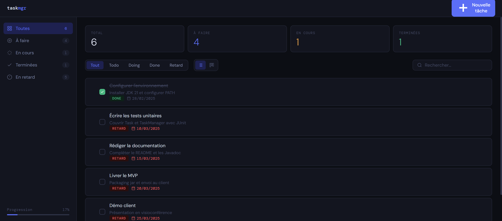

# TaskMgr - Gestionnaire de tâches Java

**Auteur :** Félix Vandenbroucke · Dev 2026

Application de gestion de tâches construite en Java pur, sans framework ni dépendance externe. Deux modes : **terminal interactif** et **interface web dark mode** avec API REST. Persistence JSON avec écriture atomique, 217 tests, CI GitHub Actions.



---

## Fonctionnalités

- Créer, modifier, supprimer des tâches avec titre, description, date d'échéance, statut et priorité
- **Priorités** LOW / MEDIUM / HIGH avec pills colorées dans l'UI
- **Statuts** TODO / DOING / DONE avec vue liste et vue Kanban (drag & drop entre colonnes)
- **Dates colorées** : orange si échéance dans ≤ 3 jours, rouge si dépassée
- **Filtres** par statut, recherche live, progression globale en sidebar
- **Export CSV** en un clic
- Raccourcis clavier : `n` nouvelle tâche · `Ctrl+Enter` valider · `Échap` fermer
- Mode console complet avec menus interactifs

---

## Stack

| Couche      | Technologie                                      |
|-------------|--------------------------------------------------|
| Backend     | Java 21, `com.sun.net.httpserver` (JDK built-in) |
| Frontend    | HTML / CSS / JS vanilla, zéro framework          |
| Persistence | JSON maison avec écriture atomique               |
| Tests       | Framework maison, zéro dépendance externe        |
| CI          | GitHub Actions                                   |

---

## Structure du projet

```
taskmanager/
├── src/
│   ├── Main.java              point d'entrée - modes console et web
│   ├── Task.java              modèle de données, sérialisation JSON, export CSV
│   ├── TaskManager.java       CRUD, persistence, statistiques
│   ├── ConsoleUI.java         interface terminal
│   └── ApiServer.java         serveur HTTP REST, zéro dépendance
├── tests/
│   ├── TaskManagerTest.java   129 assertions - logique métier
│   └── ApiServerTest.java      88 assertions - intégration HTTP
├── web/
│   ├── index.html             structure HTML
│   ├── style.css              styles (dark mode, kanban, animations)
│   └── app.js                 logique frontend (API calls, render, drag & drop)
├── assets/
│   └── welcome.png            screenshot
├── .github/workflows/ci.yml   CI GitHub Actions
├── Makefile
├── tasks.json                 sauvegarde automatique
└── README.md
```

---

## Prérequis

**Java 17 ou supérieur** (switch expressions).

```bash
java -version
javac -version
```

---

## Lancement rapide

```bash
# Compiler
make build

# Mode console
make run

# Mode web → http://localhost:8080
make web

# Port personnalisé
make web PORT=3000
```

Sans Make :

```bash
mkdir -p out
javac -d out src/Task.java src/TaskManager.java src/ConsoleUI.java src/ApiServer.java src/Main.java
java -cp out taskmanager.Main --web
```

### JAR

```bash
make jar
java -jar TaskManager.jar --web
```

---

## API REST

| Méthode  | Endpoint                     | Description                            |
|----------|------------------------------|----------------------------------------|
| `GET`    | `/api/tasks`                 | Liste toutes les tâches                |
| `GET`    | `/api/tasks?status=TODO`     | Filtre par statut (TODO/DOING/DONE)    |
| `POST`   | `/api/tasks`                 | Crée une tâche                         |
| `PUT`    | `/api/tasks/{id}`            | Modifie une tâche (champs partiels OK) |
| `DELETE` | `/api/tasks/{id}`            | Supprime une tâche                     |
| `GET`    | `/api/stats`                 | Statistiques par statut                |
| `GET`    | `/api/export`                | Export CSV de toutes les tâches        |
| `GET`    | `/`                          | Sert le frontend                       |

Corps JSON pour POST / PUT :

```json
{
  "title": "Nom de la tâche",
  "description": "Détails optionnels",
  "dueDate": "2026-06-15",
  "status": "TODO",
  "priority": "HIGH"
}
```

---

## Tests

**217 assertions, zéro dépendance externe.**

```bash
# Tout lancer
make test

# Unitaires seulement (Task, TaskManager)
make test-unit

# Intégration seulement (HTTP, API REST)
make test-api
```

Sans Make :

```bash
javac -cp out -d out tests/TaskManagerTest.java tests/ApiServerTest.java
java -cp out taskmanager.TaskManagerTest
java -cp out taskmanager.ApiServerTest
```

Les tests d'intégration démarrent un vrai serveur HTTP sur un port libre et envoient de vraies requêtes - pas de mock. Retourne exit code 0 si tout passe, 1 sinon (compatible CI).

---

## Format `tasks.json`

Écriture atomique : les données sont écrites dans un fichier `.tmp` puis déplacées sur le fichier final - aucune perte possible en cas de coupure.

```json
[
  {"id":1,"title":"Configurer l'environnement","description":"Installer JDK 21","dueDate":"2025-02-28","status":"DONE","priority":"HIGH"},
  {"id":2,"title":"Ecrire les tests unitaires","description":"Couvrir Task et TaskManager","dueDate":"2025-03-10","status":"DOING","priority":"MEDIUM"},
  {"id":3,"title":"Rediger la documentation","description":"README et Javadoc","dueDate":"2025-03-15","status":"TODO","priority":"LOW"}
]
```

Champs : `id`, `title`, `description`, `dueDate` (ISO : AAAA-MM-JJ), `status`, `priority`.
Les fichiers sans champ `priority` sont chargés avec MEDIUM par défaut (rétrocompatible).
